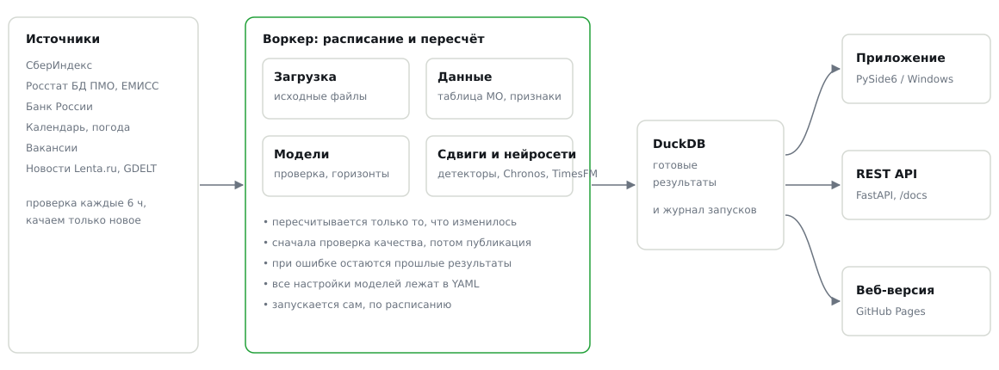
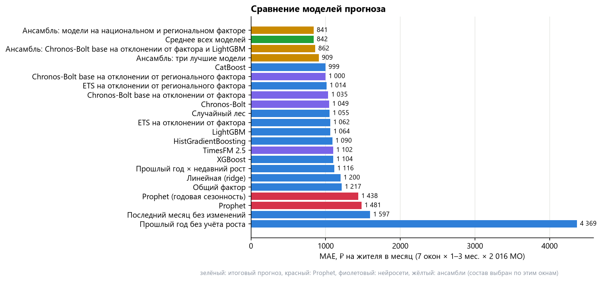
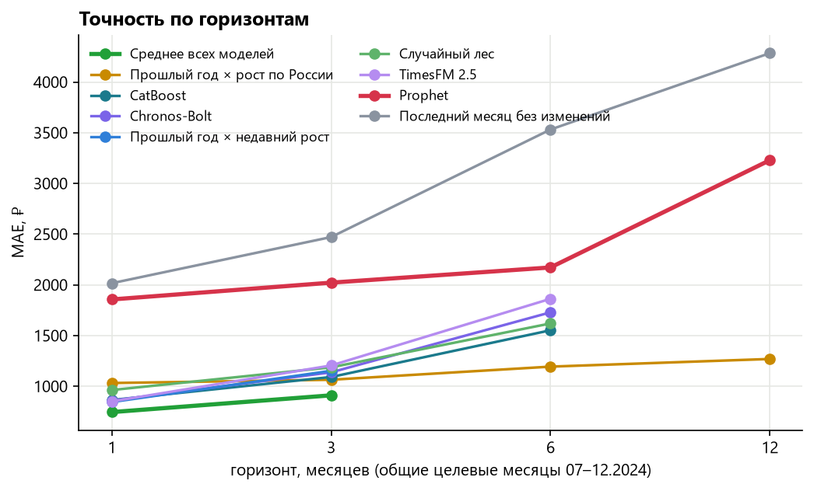
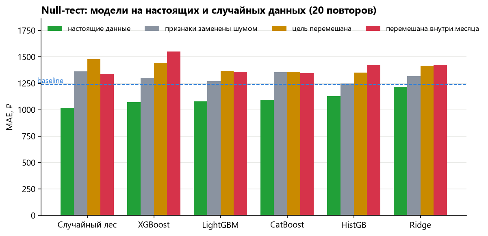
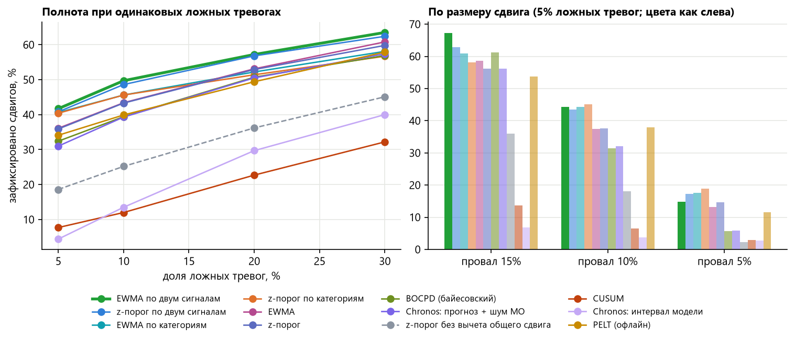
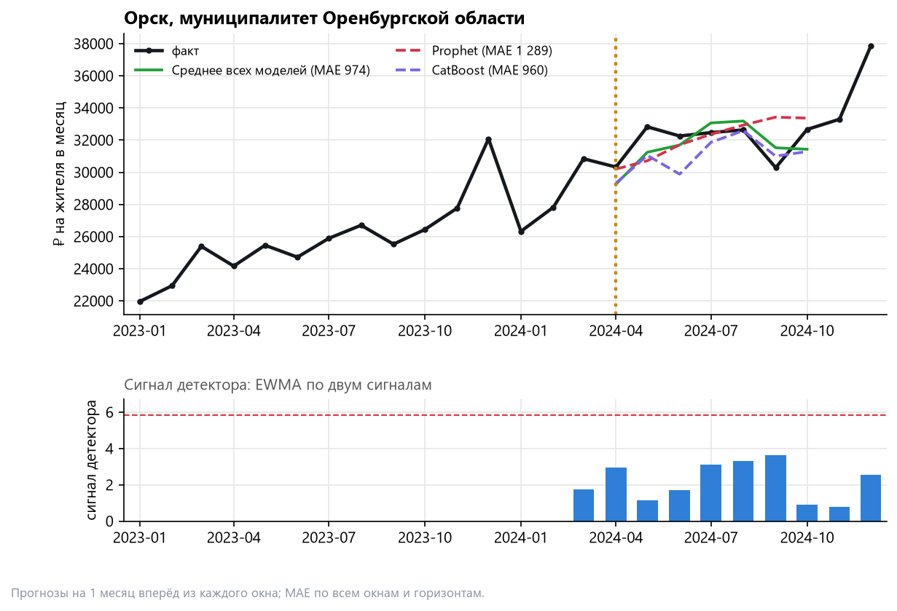
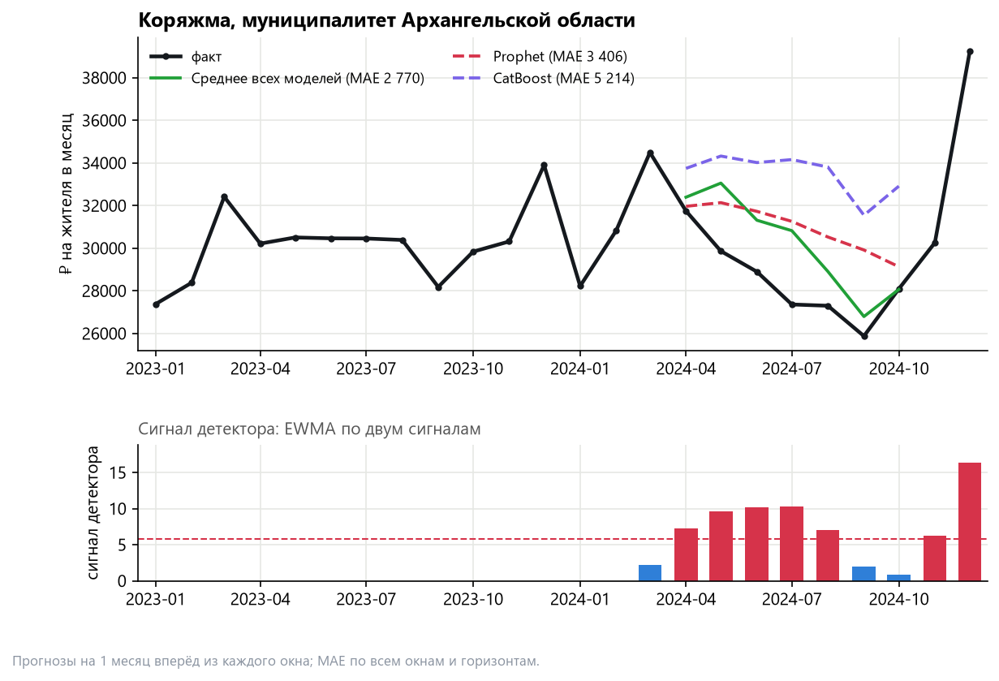

# Прогнозирование потребительских расходов муниципалитетов и обнаружение структурных сдвигов

Методологический отчёт

> Цифры отчёта – по состоянию на 9 октября 2026 г.: данные СберИндекса за 01.2023–12.2024, проверка моделей от 09.10.2026. Приложение само скачивает свежие данные и пересчитывает результаты, поэтому после выхода новых данных его цифры могут отличаться от отчёта.

---

## 1. Кратко

Задача: прогнозировать, сколько в среднем тратит по карте житель каждого муниципалитета, и как можно раньше замечать месяцы, когда расходы МО резко уходят от общего тренда страны.

**Как это работает, в четыре шага.**

- **Берём расходы.** Сколько в месяц тратит по карте один житель каждого муниципалитета, данные СберИндекса за 2023–2024 гг. и открытая статистика.
- **Строим прогнозы.** 14 моделей, от простого «как год назад» до нейросетей. Итоговый прогноз их среднее: так он устойчивее любой отдельной модели.
- **Проверяем на прошлом.** Каждая модель запускается в прошлом: она видит данные только до выбранного месяца и прогнозирует следующие. Одна такая проверка называется окном, всего их семь. Прогноз сравнивается с тем, что было на самом деле.
- **Ищем сдвиги.** Если расходы МО вдруг пошли иначе, чем по стране, детектор поднимает тревогу. Новости предупреждают о шоке примерно на месяц раньше данных.

Главная метрика MAE: на сколько рублей в среднем ошибается прогноз расходов одного жителя за месяц. Чем меньше, тем лучше. Prophet, с которым идёт сравнение, это готовая популярная модель прогноза от Meta.

- **Данные.** Официальный набор СберИндекса: безналичные расходы на жителя по 2 190 территориям (2 189 муниципальных образований, МО: Павлово-Посадский округ записан двумя кодами) 74 регионов с января 2023 по декабрь 2024 г., 6 категорий. Через справочник СберИндекса (код территории → ОКТМО) МО связаны с Росстатом: население, 21 годовой показатель МО, цены, услуги, безработица. Ещё используем данные ЦБ, погоду, производственный календарь и общероссийский рост расходов из дашбордов СберИндекса.
- **Прогноз.** Лучший результат дало простое среднее 14 моделей. Оно ошибается в среднем на **842 ₽ на жителя в месяц, а Prophet на 1 481 ₽, то есть наша ошибка на 43% меньше**. Простого правила «как год назад × текущий рост» оно точнее на 25%. Состав среднего ничем не подбирался. Мы отдельно проверили, не лучше ли каждый раз брать модели, которые хорошо работали в прошлом. Оказалось, хуже: на окнах 05–09.2024 у среднего всех 797 ₽, у жадного выбора 902 ₽, у лучшей модели по прошлому 1 088 ₽. Модели проверены так, как работали бы в жизни: 7 точек прогноза в 2024 г., модель видит только прошлое, 2 016 МО с полной историей, 42 336 прогнозов на каждую модель.
- **Горизонты.** Prophet проигрывает на всех четырёх. На 1 и 3 месяца точнее всего среднее всех моделей (на 60% и 55% точнее Prophet). На 6 и 12 месяцев лучше простая модель «тот же месяц год назад × рост расходов по России» (на 45% и 61%): для длинного прогноза собственной истории МО не хватает, а общероссийский рост СберИндекс публикует с 2018 г.
- **Нейросети.** Chronos-Bolt (Amazon) и TimesFM 2.5 (Google) без дообучения точнее Prophet на 26–29%. Лучше всего Chronos работает, если снять с ряда общую волну региона и прогнозировать только отклонение МО. Тогда ошибка 1 000 ₽, почти как у лучшей одиночной модели CatBoost (999 ₽).
- **Шоки.** Лучший детектор называется EWMA по двум сигналам: он следит за всеми расходами и за четырьмя категориями и тревожит по более сильному сигналу. При 5% ложных тревог он ловит 42% искусственных провалов в первые два месяца, а провалов на 15% ловит 67%. На сдвигах вверх и временных провалах он тоже среди лучших. Главный приём здесь вычесть общий для страны рост: без этого доля зафиксированных падает вдвое. Реальные паводки 2024 г. в расходах слабые; вместе с новостью детектор отмечает 3 из 6 затопленных МО.
- **Новости.** 112 тыс. новостей Lenta.ru и 7,6 млн событий GDELT привязаны к МО и регионам по дате публикации, классификатор отбирает новости, важные для расходов (F1 0,80 против 0,50 у словарей), и определяет тип события (macro-F1 0,72 против 0,33). Новость о паводке выходит в первые сутки после события, на месяц раньше данных СберИндекса. Точность прогноза новости как признак не повышают (раздел 7). Их польза в другом: они заранее предупреждают и объясняют тревоги.
- **Насколько этому верить.** На намеренно испорченных данных модели ошибаются сильнее, чем на настоящих, во всех 360 прогонах null-теста. Интервал прогноза 80% на скользящей проверке накрывает 78% фактов.

---

## 2. Данные и почему им можно доверять

| Источник | Что | Уровень, частота | Период |
|---|---|---|---|
| СберИндекс, официальный набор | безналичные расходы на жителя, 6 категорий; код территории МО | МО, месяц | 01.2023–12.2024 |
| СберИндекс, справочник МО | код территории → ОКТМО, тип МО, регион, центр | МО | 2018–2024 |
| СберИндекс, дашборды | рост безналичных расходов по России, % г/г | страна, месяц | 2018–2026 |
| Росстат, БД ПМО | 21 показатель: население, демография, труд, производство, бюджет | МО, год | 2017–2025 |
| Росстат, ЕМИСС | ИПЦ (общий, продовольствие, непродовольственные, услуги), платные услуги, общепит, безработица | регион, месяц/квартал | 2017–2026 |
| ЦБ РФ | курсы валют, вклады населения | страна / регион, месяц | 2012–2026 |
| Open-Meteo | температура и осадки, аномалии | регион, месяц | 2019–2026 |
| Производственный календарь | рабочие дни, праздники | страна, месяц | 2022–2026 |
| «Работа России» | вакансии (обезличенные) | адрес → МО/регион, срез | с 09.2026 |

Данные СберИндекса распространяются по лицензии CC BY-SA 4.0, источники перечислены в `README.md`.

**Проверки качества** (`reports/validation.md`, `reports/data_audit.md`):

- расходы СберИндекса по России совпадают с Росстатом: медианное расхождение 0,000%, ни одного месяца с расхождением больше 1%; реальные приросты коррелируют с ИПЦ Росстата на 0,998;
- МО связаны с Росстатом по коду, а не по названию: у каждого МО официального набора свой код территории, и справочник СберИндекса переводит его в ОКТМО. Сопоставлены все 2 190 МО (два кода Павловского Посада, до и после объединения, дают один ряд), население найдено для 2 185. МО панели покрывают 82% населения России;
- панель чистая: ни одного дубля, ни одного скачка месяц к месяцу больше 50%. Полная история за 24 месяца есть у 2 016 МО, на них и проверяется прогноз;
- ошибки источников найдены и исправлены: коды регионов в таблицах ИПЦ, потерянные ведущие нули в ОКТМО, промежуточные итоги в таблицах численности;
- каждый сырой файл записан в `data/raw/MANIFEST.csv` с контрольной суммой SHA-256.

*Первая версия решения строилась на выгрузке с сайта, где МО названы только по имени: тёзки из разных регионов там слиты, и в панель попало 2 059 МО. На официальном наборе с кодами МО больше, а значения у общих МО совпадают до рубля.*

---

## 3. Методология

**Что прогнозируем.** Сколько в среднем тратит по карте один житель муниципалитета за месяц. У каждого МО свой уровень: в Москве и в сельском районе цифры отличаются в разы. Но почти у всех похожая сезонность (декабрьский всплеск, январский провал) и общий для страны рост цен. Поэтому мы прогнозируем не сами рубли, а то, **насколько этот месяц будет больше того же месяца прошлого года**. Рубли получаются умножением прошлогоднего значения на прогноз роста. Сезонность при этом учитывается сама собой.

**Самый простой прогноз** берёт тот же месяц год назад и умножает на нынешний темп роста (baseline). Он уже неплох, и всё остальное сравнивается с ним и с Prophet.

**Модели посложнее** учатся сразу на всех муниципалитетах: у одного МО всего 24 месяца, а у двух тысяч набираются десятки тысяч наблюдений. Одни модели (бустинги, случайный лес) смотрят на признаки: недавний рост, численность населения, цены и погоду в регионе, праздники. Другие отделяют общую для региона волну от собственного отклонения МО и прогнозируют только отклонение. Нейросети Chronos и TimesFM заранее обучены на миллионах чужих рядов и прогнозируют без дообучения. Итоговый прогноз считается как **простое среднее всех моделей**: они ошибаются в разные месяцы, и среднее гасит провалы каждой.

**Как проверяем.** Как в жизни: модель «ставится» в март 2024 г., видит только данные до марта и прогнозирует апрель–июнь. Потом то же из апреля, мая и так до сентября, всего 7 раз. Будущее модели не видят ни в одном из прогонов.

**Как устроено решение.** Воркер по расписанию скачивает только изменившиеся источники, собирает таблицы, проверяет качество, пересчитывает модели и детекторы и публикует результат в базу DuckDB. Приложение, REST API и веб-версия читают одну и ту же базу, поэтому цифры везде одинаковые.

Слева направо: откуда берутся данные, кто их обрабатывает (воркер скачивает, собирает, проверяет и считает модели), где хранятся результаты (база DuckDB) и где их видит пользователь (приложение, REST API, веб-версия).

**Как ищем шоки.** Если расходы МО выросли на 15% и у всей страны тоже на 15%, ничего особенного не случилось. Поэтому из роста МО вычитаем медианный рост всех МО за тот же месяц. Остаётся то, что произошло **именно здесь**. Это отклонение меряем в «обычных колебаниях» самого МО: для маленького района скачок на 5% в порядке вещей, а для большого города – это событие. Детектор каждый месяц сравнивает новое значение со сглаженным прошлым и поднимает тревогу, если отклонение слишком большое. Порог выбран так, чтобы у 95% обычных МО за год не было ни одной ложной тревоги. Тот же сигнал считается по четырём категориям (продукты, здоровье, маркетплейсы, транспорт): паводок сильнее бьёт по отдельным категориям, чем по сумме. Тревога звучит по более сильному из двух сигналов.

**Зачем новости.** Данные СберИндекса выходят раз в месяц, а новость появляется в день события. Новость о паводке или закрытии завода предупреждает на месяц раньше данных и объясняет, почему детектор поднял тревогу.

---

## 4. Прогноз: сравнение моделей и выбор лучшей

### 4.1. Постановка

- **Цель.** Логарифм роста к тому же месяцу прошлого года: `g = log y_T − log y_{T−12}`; уровень `ŷ_T = y_{T−12} · exp(ĝ)`. Функция потерь: абсолютная ошибка, взвешенная уровнем `y_{T−12}`, то есть оптимизируется MAE в рублях.
- **Признаки** (без заглядывания в будущее): недавний рост МО и его ускорение, прошлогодний сезонный шаг, общий по стране рост, численность и тип МО; региональные ИПЦ, услуги, общепит и погода с запаздыванием 1 месяц; безработица с запаздыванием 3 месяца; годовые показатели МО за год t−2 (так они реально публикуются); календарь, курсы валют. Номер целевого месяца исключён: в обучении нет октябрей–декабрей с известным ростом, и модель переносила бы на них поведение сентября.
- **Модели на отклонении от фактора.** Фактор считается как медиана логарифма расходов по МО в каждом месяце: по всей стране (национальный) или по МО региона (региональный). Сезонность фактора оценивается по двум тысячам рядов почти без шума, чего нельзя сделать по 24 точкам одного МО. Ряд МО делится на фактор и отклонение от него. Фактор прогнозируется как «прошлый год × средний рост г/г», отклонение прогнозирует модель без сезонности (ETS или Chronos-Bolt). Фактор в момент прогноза считается по уже известным уровням всех МО, так что заглядывания в будущее нет.
- **Проверка.** Проверка на истории (rolling-origin backtest): 7 месячных окон прогноза, из каждого месяца с марта по сентябрь 2024 г., на 1–3 месяца вперёд; 2 016 МО с полной историей; одинаковые 42 336 точек у всех моделей. Отдельно показана ошибка последнего окна (09.2024) и худшего окна: одна средняя по окнам скрывает, насколько модель устойчива.

**Модели и гиперпараметры** (`configs/models.yaml`, `configs/default.yaml`; seed 42, у CatBoost среднее seed 1–4). Гиперпараметры заданы заранее по общепринятым значениям, одинаковы для всех окон и под тестовые окна не подбирались.

| Модель | Что это | Главные гиперпараметры |
|---|---|---|
| Naive | последнее значение | нет |
| Прошлый год без учёта роста | тот же месяц год назад | нет |
| Прошлый год × недавний рост | тот же месяц год назад × рост г/г за последние k месяцев | k = 3 |
| Prophet | модель тренда и сезонности, по каждому МО отдельно | годовая сезонность auto / порядок 3 |
| LightGBM, XGBoost, CatBoost | градиентный бустинг деревьев, одна модель на все МО, потери MAE | 400 деревьев, шаг 0,03, 31 лист / глубина 6, подвыборки 0,8; CatBoost: среднее 4 моделей с seed 1–4 |
| HistGradientBoosting | тот же бустинг из scikit-learn | 400 итераций, шаг 0,03, 31 лист |
| Случайный лес | среднее 300 независимых деревьев | лист ≥ 5 наблюдений, 50% признаков на разбиение |
| Ridge | линейная регрессия со штрафом L2 | α = 1; без признаков уровня месяца (см. 4.2) |
| Chronos-Bolt, TimesFM 2.5 | предобученные нейросети, без обучения на наших данных | прогноз ряда роста г/г, квантили 0,1/0,5/0,9 |
| Общий фактор | прогноз фактора, отклонение МО держится на последнем значении | национальный фактор |
| ETS на отклонении от фактора | экспоненциальное сглаживание отклонения без сезонности (выбор модели по AICc) | национальный / региональный фактор |
| Chronos-Bolt base на отклонении от фактора | нейросеть прогнозирует отклонение МО от фактора | национальный / региональный фактор |
| Среднее всех моделей | среднее прогнозов 14 одиночных моделей выше | состав не подбирается |
| Ансамбли | среднее прогнозов нескольких моделей | состав выбран по окнам этого же проверки на истории |

### 4.2. Результаты

| Модель | MAE, ₽ | WAPE | R² | R² внутри ряда | MAE окна 09.2024 | MAE худшего окна |
|---|---|---|---|---|---|---|
| **Среднее всех моделей** | **842** | 2,7% | 0,990 | 0,41 | 761 | 1 174 |
| CatBoost (среднее 4 seed) | 999 | 3,2% | 0,987 | 0,19 | 917 | 1 209 |
| Chronos-Bolt base на отклонении от регионального фактора | 1 000 | 3,2% | 0,986 | 0,15 | 936 | 1 541 |
| ETS на отклонении от регионального фактора | 1 014 | 3,2% | 0,985 | 0,11 | 951 | 1 531 |
| Chronos-Bolt base на отклонении от национального фактора | 1 035 | 3,3% | 0,983 | −0,03 | 856 | 1 852 |
| Chronos-Bolt (ряд роста г/г) | 1 049 | 3,4% | 0,985 | 0,09 | 968 | 1 535 |
| Случайный лес | 1 055 | 3,4% | 0,986 | 0,15 | 899 | 1 232 |
| ETS на отклонении от национального фактора | 1 062 | 3,4% | 0,981 | −0,16 | 923 | 1 861 |
| LightGBM | 1 064 | 3,4% | 0,985 | 0,11 | 1 064 | 1 317 |
| HistGradientBoosting | 1 090 | 3,5% | 0,985 | 0,06 | 1 172 | 1 365 |
| TimesFM 2.5 (ряд роста г/г) | 1 102 | 3,5% | 0,984 | 0,01 | 977 | 1 564 |
| XGBoost | 1 104 | 3,5% | 0,984 | 0,03 | 1 057 | 1 490 |
| Прошлый год × недавний рост | 1 116 | 3,6% | 0,983 | −0,01 | 944 | 1 759 |
| Ridge (линейная) | 1 200 | 3,8% | 0,980 | −0,20 | 1 093 | 1 438 |
| Общий фактор | 1 217 | 3,9% | 0,975 | −0,53 | 920 | 2 532 |
| Prophet (годовая сезонность, порядок 3) | 1 438 | 4,6% | 0,972 | −0,71 | 2 273 | 2 273 |
| **Prophet** | **1 481** | 4,7% | 0,966 | −1,06 | 2 201 | 2 201 |
| Naive | 1 597 | 5,1% | 0,952 | −1,93 | 3 535 | 3 535 |
| Ансамбль моделей на факторе + случайный лес + CatBoost ¹ | 841 | 2,7% | 0,990 | 0,41 | 742 | 1 322 |

¹ Состав ансамбля (Chronos и ETS на национальном и региональном факторе, простой прогноз, случайный лес, CatBoost с равными весами) выбран после просмотра окон, поэтому его MAE занижена и в сравнение моделей не входит. Среднее всех моделей без подбора даёт ту же точность (842 против 841 ₽).

**Выбор: среднее всех моделей.** У него наименьшая MAE среди моделей без подбора. **Оно точнее Prophet на 43% по MAE** (842 против 1 481 ₽), простого прогноза на 25% (842 против 1 116 ₽), лучшей одиночной модели на 16% (842 против 999 ₽). Приложение строит по нему прогноз вперёд (январь–март 2025 г.).

**Почему среднее, а не подобранный состав.** Мы проверили и другие способы собрать прогноз из моделей, так, как это было бы в жизни (`reports/backtest/models/rolling_selection.csv`): в каждом окне с 05.2024 способ видит только то, что известно к дате прогноза, и оценивается на прогнозах из неё.

| Способ | MAE, ₽ (окна 05–09.2024) |
|---|---|
| **Среднее всех моделей** | **797** |
| Медиана всех моделей | 836 |
| Chronos-Bolt base на национальном факторе (лучшая одиночная) | 889 |
| Жадный выбор состава по прошлому | 902 |
| Среднее 5 лучших по прошлому | 1 023 |
| Лучшая модель по прошлому | 1 088 |

Лидеры одних окон проваливаются на следующих: LightGBM в мае 2024 г. ошибается на 877 ₽, а в августе на 1 317 ₽. Отбор по прошлой ошибке подхватывает такие модели, а среднее гасит их провалы. Проверка с одной точкой разреза (`holdout.csv`) говорит то же: состав, выбранный по известному к июлю 2024 г., на поздних окнах (953 ₽) хуже одиночного Chronos-Bolt base (878 ₽). Правило «среднее всех» выбрано после этой проверки, но оно самое простое из возможных и не содержит ни одного параметра, подобранного на окнах.

**CatBoost: среднее 4 seed.** Одна модель CatBoost заметно зависит от случайного seed (разброс MAE между seed около 2%), поэтому берётся среднее четырёх моделей с seed 1–4.

Что важно знать про этот выигрыш:

- **Одиночные модели точнее простого прогноза скромно, на 10–11%** (999–1 000 против 1 116 ₽). Простой прогноз «прошлый год × текущий рост» уже учитывает сезонность и инфляцию, и основная часть отрыва от Prophet приходится на него.
- **Тройка одиночных лидеров почти равна:** 999, 1 000 и 1 014 ₽, разница меньше 2%, в пределах разброса между окнами. Три разных подхода (бустинг на признаках, нейросеть на факторе, ETS на факторе) приходят к одной точности, но ошибаются в разных окнах. Поэтому их среднее заметно точнее каждого.
- **Окна неравноценны.** В окне 03.2024 рост г/г скачком вырос с ~9% в I квартале до ~17% в апреле–июне. Модели на факторе этого не видят и ошибаются сильнее (1 541 ₽), модели на признаках устойчивее (CatBoost 1 209, случайный лес 1 059 ₽). На последнем окне модели на признаках точнее простого прогноза (CatBoost 917, случайный лес 899 против 944 ₽), а Chronos на региональном факторе почти вровень с ним (936 ₽). Поэтому в среднем всех моделей есть обе группы. Худшее окно у среднего даёт 1 174 ₽, это лучше любой одиночной модели.

Каждая полоса соответствует модели, длина показывает её среднюю ошибку в рублях на жителя в месяц. Чем короче, тем точнее. Зелёным выделена выбранная модель (среднее всех моделей), красным Prophet (эталон для сравнения), фиолетовым готовые нейросети, жёлтым ансамбли (их состав подобран на этих же данных, поэтому их полоса короче, чем была бы при проверке без подбора), синим остальные.

**Ridge.** В первой версии линейная модель ошибалась вдвое сильнее простого прогноза и хуже, чем на случайных признаках в null-тесте (раздел 4.4). Причин оказалось две. Первая связана с ошибкой реализации: веса наблюдений (уровень расходов год назад, ~25 тыс. ₽) не были нормированы, штраф α терялся на фоне суммы весов, и регуляризация фактически не работала. Вторая связана со свойством модели: признаки уровня месяца (общий по стране рост, курс, ИПЦ, календарь) одинаковы для всех МО и в обучении принимают всего 3–9 значений, поэтому прямая, проведённая по ним, на новом месяце уходит далеко. Деревья за пределы виденного не выходят, поэтому им эти признаки оставлены, а ridge обучается без них. После исправления ошибка 1 200 ₽, и этого недостаточно, чтобы обогнать baseline.

**Почему Prophet проигрывает.** Prophet строится по каждому МО отдельно и по 15–21 точке не выделяет годовую сезонность: R² внутри ряда у него отрицательный, то есть он хуже простого среднего значения ряда. Наши модели берут сезонность у всех МО сразу: из прошлогоднего значения и роста г/г (простой прогноз, модели на признаках) или из общего фактора, оценённого по двум тысячам рядов.

### 4.3. Горизонты 1, 3, 6, 12 месяцев

Все горизонты проверяются на одних и тех же целевых месяцах (июль–декабрь 2024 г.): для горизонта H прогноз строится из месяца «цель − H». Так разница между горизонтами показывает цену дальности прогноза, а не разницу между месяцами.

| Модель | 1 мес. | 3 мес. | 6 мес. | 12 мес. |
|---|---|---|---|---|
| **Среднее всех моделей** | **746** | **911** | н/д | н/д |
| **Прошлый год × рост по России** | 1 032 | 1 065 | **1 194** | **1 269** |
| CatBoost (среднее 4 seed) | 865 | 1 092 | 1 552 | н/д |
| Chronos-Bolt base на отклонении от регионального фактора | 855 | 1 085 | 1 821 | н/д |
| Chronos-Bolt base на отклонении от национального фактора | 782 | 1 081 | 1 849 | н/д |
| ETS на отклонении от регионального фактора | 887 | 1 102 | 1 736 | н/д |
| Прошлый год × недавний рост | 845 | 1 153 | н/д | н/д |
| Chronos-Bolt (ряд роста г/г) | 859 | 1 138 | 1 729 | н/д |
| TimesFM 2.5 (ряд роста г/г) | 851 | 1 205 | 1 863 | н/д |
| LightGBM | 1 043 | 1 216 | 1 552 | н/д |
| Случайный лес | 963 | 1 187 | 1 620 | н/д |
| Ridge (линейная) | 1 009 | 1 266 | 2 920 | н/д |
| **Prophet** | 1 856 | 2 022 | 2 172 | 3 229 |
| Naive | 2 016 | 2 472 | 3 532 | 4 285 |
| Ансамбль моделей на факторе + лес + CatBoost ¹ | 708 | 886 | н/д | н/д |

¹ Состав ансамбля выбран по окнам основной проверки на истории, которые пересекаются с целевыми месяцами, поэтому его MAE занижена и в выбор лучшей модели он не входит.

**1 и 3 месяца.** Лучшее здесь среднее всех моделей: на 60% и 55% точнее Prophet (746 против 1 856 ₽ и 911 против 2 022 ₽).

**6 и 12 месяцев: рост по России.** Прогноз на 12 месяцев строится из второй половины 2023 г., когда роста г/г самого МО ещё нет: панель начинается с января 2023 г. Поэтому среднему всех моделей и моделям на признаках здесь не на чем учиться. Но общероссийский рост безналичных расходов СберИндекс публикует с 2018 г. (дашборд «Потребительские расходы», % г/г), и на дату прогноза он известен. Модель: `ŷ_T = y_{T−12} · (1 + g_РФ)`, где `g_РФ` означает рост по России за месяц до даты прогноза (месяц оставлен как запас на задержку публикации). Параметров у неё нет. На 12 месяцев она на 61% точнее Prophet (1 269 против 3 229 ₽), на 6 месяцев на 45% (1 194 против 2 172 ₽) и точнее всех моделей на признаках (у CatBoost и LightGBM 1 552 ₽): на длинном горизонте общий темп страны надёжнее экстраполяции собственной динамики МО. На 1–3 месяцах она уступает среднему всех моделей, потому что там уже известен свежий рост самого МО. Модель добавлена, когда на 12 месяцах оставались только Prophet и наивные прогнозы; проверена на тех же целевых месяцах, что и остальные.

По горизонтали отложено, на сколько месяцев вперёд делается прогноз, по вертикали средняя ошибка в рублях. Чем ниже, тем лучше. Ошибка растёт с дальностью у всех моделей. Толстая красная линия соответствует Prophet: всё, что ниже неё, точнее эталона. Линия обрывается, если модели не хватило истории для такого горизонта.

«н/д» значит, что модели не хватает истории: прогноз на 12 месяцев строится из 2023 г., когда роста г/г самого МО ещё нет, а простой прогноз требует 15 месяцев. Модель, покрывшая не все целевые месяцы, получает «н/д», чтобы её ошибка не считалась на других точках. Нейросети «по уровням» на 12 месяцах хуже Prophet (5 533–6 480 ₽): история короче года ограничивает и их.

### 4.4. Проверка на случайность (null-тест)

Вопрос в том, не выигрывает ли модель случайно, например за счёт того, что угадывает общий тренд страны. Чтобы проверить, мы берём те же модели, но намеренно портим данные, 20 повторов каждого сценария с разным случайным зерном (`scripts/run_null_test.py`). Тест проверяет модели на признаках. Он долгий (около 2,5 часа), поэтому проведён один раз, на первой версии панели (1 896 МО) и прежней схеме проверки из 3 окон (03, 06, 09.2024). Поэтому MAE на настоящих данных в таблице ниже отличается от раздела 4.2. Модели на факторе признаков не используют, для них этот тест не применим.

- **Признаки заменены шумом:** все признаки заменены случайными числами, цель настоящая.
- **Цель перемешана:** рост г/г перемешан между строками обучения, и связь признаков с целью разорвана.
- **Перемешана внутри месяца:** рост перемешан между МО внутри одного целевого месяца. Общий темп страны сохраняется, исчезают только различия между МО.

| Модель | Настоящие данные | Признаки заменены шумом | Цель перемешана | Внутри месяца | Лучше простого прогноза, 95% ДИ | Доля МО, где лучше простого прогноза |
|---|---|---|---|---|---|---|
| **Случайный лес** | **1 017** | 1 364 | 1 480 | 1 341 | 17–19% | 73% |
| XGBoost | 1 072 | 1 301 | 1 444 | 1 551 | 12–15% | 66% |
| LightGBM | 1 081 | 1 270 | 1 368 | 1 359 | 11–14% | 68% |
| CatBoost | 1 096 | 1 354 | 1 360 | 1 350 | 10–13% | 72% |
| HistGradientBoosting | 1 129 | 1 246 | 1 354 | 1 420 | 7–11% | 64% |
| Ridge | 1 218 | 1 316 | 1 419 | 1 425 | 0–4% | 60% |

MAE, ₽; для испорченных данных указано среднее по 20 повторам. Доверительный интервал выигрыша у простого прогноза получен bootstrap по МО.

**Результат.** Ни в одном из 360 испорченных прогонов (6 моделей × 3 сценария × 20 повторов) ошибка не оказалась ниже, чем на настоящих данных: p = 1/21 ≈ 0,048 для каждой модели и сценария, меньше при 20 повторах не бывает. Рост ошибки в сценарии «внутри месяца» показывает, что модели видят различия между муниципалитетами сверх общего тренда. Выигрыш случайного леса у простого прогноза устойчив: 17–19% с 95%-й уверенностью, лучше простого прогноза в 73% МО. У ridge выигрыш на границе значимости: линейной модели не хватает нелинейных связей.

Для каждой модели четыре столбца: зелёный показывает ошибку на настоящих данных, серый, жёлтый и красный на специально испорченных. Зелёный ниже остальных у всех моделей, значит, модели опираются на реальные связи в данных. Синий пунктир показывает ошибку простого прогноза: если столбец ниже пунктира, модель точнее простого прогноза.

### 4.5. Интервалы прогноза

Прогноз полезнее, если рядом с ним указано, насколько он может ошибиться. Интервал 80% строится из ошибок проверки на истории той же модели на том же горизонте (`src/eval/intervals.py`). Ошибка МО `r = log(факт / прогноз)` складывается из двух частей. Общая часть равна медиане `r` по всем МО в окне: это случай, когда модель промахнулась по всей стране, как в мае–июне 2024 г., когда рост г/г прыгнул с ~9% до ~17%. Вторая часть своя у каждого МО. Если взять квантили `r` целиком, обе части смешиваются: общих промахов в проверке на истории всего несколько, точек тысячи, и интервал выходит узким. Поэтому интервал берётся как квантили 10% и 90% свёртки: каждая своя ошибка МО плюс каждый прошлый общий промах.

Покрытие проверяется скользящим способом (`reports/backtest/models/interval_coverage.csv`): интервал строится только по ошибкам, известным к дате прогноза, и проверяется на прогнозах из неё (окна 06–09.2024).

| Модель | Квантили ошибки: покрытие | Свёртка: покрытие | Ширина (свёртка) |
|---|---|---|---|
| Среднее всех моделей | 73% | **78%** | 10,2% |
| CatBoost | 73% | **77%** | 11,4% |
| Chronos-Bolt base на национальном факторе | 78% | **81%** | 12,0% |
| Прошлый год × недавний рост | 69% | **78%** | 14,9% |

Ширина почти не меняется (+0,1–0,4 п.п.), а покрытие приближается к номиналу 80%. Слабое место осталось в окне 06.2024: общего промаха такой силы раньше не было, и покрытие там 64% (было 50%). Интервал не учитывает сдвиги сильнее тех, что встречались в 2024 г.

### 4.6. Согласование категорий с общим прогнозом

Категории (продукты, здоровье, общепит, маркетплейсы, транспорт) покрывают в среднем 72% всех расходов, остаток считается «прочим»: все минус сумма категорий. Прогнозы всех 7 рядов (CatBoost, одна модель на ряд) согласованы так, чтобы общий был суммой частей (`scripts/run_reconcile.py`): снизу вверх, OLS и WLS с весами по уровню и по прошлой ошибке ряда.

| Способ | Все расходы | Продукты | Маркетплейсы | Здоровье |
|---|---|---|---|---|
| Сумма прогнозов частей | +5,5% | 0 | 0 | 0 |
| OLS | +0,1% | −1,5% | −5,3% | +18,1% |
| WLS по прошлой ошибке | +1,5% | −0,7% | −5,6% | +0,1% |
| WLS по уровню | +3,4% | −1,3% | −1,3% | 0,0% |

Изменение MAE к прогнозам без согласования. Прогноз всех расходов согласование не улучшает, поэтому в решение оно не входит; прогнозы категорий согласованы с общим только в смысле одинаковых признаков и окон.

---

## 5. Фундаментальные модели временных рядов

**Модели.** Chronos-Bolt Small и Base (Amazon) и TimesFM 2.5 (Google, 925 МБ): нейросети, обученные на миллионах временных рядов. Прогноз строится без обучения на наших данных (zero-shot), локально на процессоре, лицензия Apache-2.0.

**Как применены.**
1. **Прогноз роста, а не уровня.** По уровням с 21 точкой истории модели не выделяют годовую сезонность: ошибка 2 400–3 700 ₽, хуже простого прогноза. Прогноз ряда роста г/г с переносом на прошлогодний уровень даёт 1 049 ₽ (Chronos-Bolt) и 1 102 ₽ (TimesFM): на 26–29% лучше Prophet и лучше простого прогноза.
2. **Прогноз отклонения от фактора.** Сезонность берётся у фактора (медиана по МО региона), а нейросеть прогнозирует только отклонение МО от него. Chronos-Bolt base на региональном факторе даёт 1 000 ₽, почти как лучшая одиночная модель (у CatBoost 999 ₽, раздел 4.2).
3. **Те же окна и метрики,** что у всех моделей; результаты приведены в таблицах раздела 4.
4. **Часть среднего всех моделей.** Ошибки нейросети на факторе мало похожи на ошибки деревьев на признаках (они проигрывают в разных окнах), поэтому среднее обеих групп точнее каждой (842 ₽).
5. **Детектор сдвигов:** раздел 6.

**Вывод.** Сама по себе нейросеть на коротком ряде одного МО уступает моделям на признаках. Но если снять с ряда сезонность общим фактором и дать ей прогнозировать только отклонение, она догоняет лучшую модель на признаках (1 000 ₽ против 999 ₽ у CatBoost) и опережает ETS на том же факторе.

---

## 6. Обнаружение структурных сдвигов: сравнение и выбор

### 6.1. Постановка и правила сравнения

Размеченных сдвигов в данных нет, поэтому качество измерено на синтетике: 10 раз случайным 10% МО с известного месяца (март–октябрь 2024 г.) уровень расходов снижается на 5, 10 или 15%, всего 2 010 сдвигов. Порог каждого метода подобран так, чтобы доля «чистых» МО с хотя бы одной ложной тревогой за год была одинаковой (5%, также 10/20/30%). Сдвиг считается зафиксированным, если тревога прозвучала в месяц сдвига или в следующие два месяца. Сравнивать детекторы имеет смысл только при одинаковой доле ложных тревог: детектор, который тревожит всегда, «поймал» бы всё.

**Сигнал.** Для МО *i* в месяце *t* 2024 г. локальный рост `x = g − медиана g по всем МО`, где g означает логарифм роста г/г. Шум МО `σ` оценивается робастно (MAD) по разбросу его помесячных изменений в 2023 г., нормированный сигнал `z = x / σ`. Каждый детектор превращает ряд `z` в силу сигнала `s`, тревога звучит при `s > h`.

| Детектор | Сила сигнала | Режим |
|---|---|---|
| z-порог | `|z_t − медиана(z_1 … z_t−1)|` | онлайн |
| EWMA | `|z_t − m_t−1|`, где `m_t = 0,3·z_t + 0,7·m_t−1` | онлайн |
| CUSUM | накопленные отклонения от уровня первых месяцев сверх 0,5 (вверх и вниз) | онлайн |
| BOCPD | вероятность, что последний сдвиг был в этом или прошлом месяце (Adams & MacKay, 2007; риск сдвига 1/12 в месяц) | онлайн |
| PELT | точное разбиение ряда на куски с минимумом «сумма квадратов + штраф × число разломов», сверено с библиотекой ruptures | офлайн |
| Chronos: прогноз + шум МО | `|z_t − медиана прогноза Chronos по истории до t−1|` | онлайн |
| Chronos: интервал модели | выход факта за прогноз в долях половины интервала 10–90% | онлайн |
| EWMA / z-порог по категориям | тот же детектор на среднем `z` четырёх категорий (продукты, здоровье, маркетплейсы, транспорт) × √4 | онлайн |
| EWMA / z-порог по двум сигналам | больший из двух: сила по всем расходам и по категориям, каждая делённая на свою медиану по рядо-месяцам | онлайн |

**Сигнал по категориям.** Паводок апреля 2024 г. сдвинул все расходы на 2–5 п.п. при обычном шуме ~3 п.п., а маркетплейсы, здоровье и транспорт в тех же МО на 7–14%; шум категорий частично независим. Общепит не берётся: у малых МО редкие траты дают скачки в сотни σ. На синтетике сдвиг всех расходов переносится в каждую категорию с множителем U(0, 2): в среднем так же, но по-разному в разных категориях. Устойчивость к этому допущению мы проверили на первой версии панели: если сдвинуть только расходы вне категорий (~28%), детектор по одним категориям ловит 2% сдвигов, по двум сигналам 33%, по всем расходам 38%. Поэтому выбран детектор по двум сигналам: он не слепнет, когда категории не задеты.

**Калибровка порога.** Для каждого детектора и целевой доли ложных тревог f порог h равен квантилю уровня 1 − f максимума силы сигнала за год по МО без внесённых сдвигов. Так у всех детекторов одинаковая доля «чистых» МО, по которым была хотя бы одна ложная тревога.

### 6.2. Результаты (5% ложных тревог)

| Детектор | Режим | Зафиксировано | −5% | −10% | −15% | F1 | Задержка, мес. |
|---|---|---|---|---|---|---|---|
| **EWMA по двум сигналам** | онлайн | **42%** | 15% | 44% | 67% | **0,45** | 0,05 |
| z-порог по двум сигналам | онлайн | 41% | 17% | 43% | 63% | 0,44 | 0,15 |
| EWMA по категориям | онлайн | 41% | 18% | 44% | 61% | 0,44 | 0,05 |
| z-порог по категориям | онлайн | 40% | 19% | 45% | 58% | 0,44 | 0,15 |
| EWMA (все расходы) | онлайн | 36% | 13% | 38% | 59% | 0,40 | 0,06 |
| z-порог | онлайн | 36% | 15% | 38% | 56% | 0,40 | 0,15 |
| BOCPD (байесовский) | онлайн | 32% | 6% | 31% | 61% | 0,37 | 0,02 |
| Chronos: прогноз + шум МО | онлайн | 31% | 6% | 32% | 56% | 0,35 | 0,02 |
| PELT | офлайн | 34% | 12% | 38% | 54% | 0,38 | 0,04 |
| z-порог без вычета общего сдвига | онлайн | 19% | 2% | 18% | 36% | 0,23 | 0,28 |
| CUSUM | онлайн | 8% | 3% | 7% | 14% | 0,10 | 1,55 |
| Chronos: интервал модели | онлайн | 4% | 3% | 4% | 7% | 0,06 | 0,00 |

F1 считается как среднее гармоническое полноты и точности. Точность показывает долю верных среди МО с тревогой (зафиксированные сдвиги / (зафиксированные + чистые МО с тревогой)) при 10% МО со сдвигом. У выбранного детектора точность 48%: примерно каждая вторая тревога указывает на настоящий сдвиг.

- **Выбор: EWMA по двум сигналам.** У него наибольшая доля зафиксированных сдвигов и наибольший F1 при одинаковых ложных тревогах (42% против 36% у EWMA по всем расходам), почти без задержки; крупные сдвиги (−15%) ловятся в 67% случаев.
- **Вычитание общего сдвига** удваивает качество (36% против 19%). Это главный элемент методики.
- **PELT** видит весь ряд задним числом, но не лучше онлайн-методов и для раннего предупреждения не подходит. Собственная реализация (точный перебор разбиений) совпала с библиотекой ruptures на всех 200 проверенных рядах.
- **CUSUM** слаб: у многих МО свой устойчивый темп роста, который CUSUM копит как сдвиг.
- **Фундаментальная модель как детектор:** прогноз Chronos хороший (31%, а на временных провалах лучший, см. 6.3), но её собственные интервалы на коротких рядах слишком узкие (4%).
- В 2024 г. выбранный детектор поднял тревоги по 113 МО из 2 016 (EWMA по всем расходам по 103).

Слева по горизонтали отложено, сколько ложных тревог мы допускаем (доля обычных МО, где тревога за год сработает зря), по вертикали доля настоящих сдвигов, которые детектор ловит. Чем выше, тем лучше; толстая зелёная линия соответствует выбранному детектору (EWMA по двум сигналам), у остальных свой цвет. Справа показано, как часто при 5% ложных тревог ловится падение расходов на 15, 10 и 5%. Крупные сдвиги ловятся заметно чаще.

### 6.3. Другие формы сдвига

Реальный шок не обязательно похож на ровную «ступеньку вниз». Чтобы выбор не держался на одной форме, те же детекторы проверены ещё на двух сценариях с той же долей ложных тревог 5% и порогом, откалиброванным заново: рост на 5–15% и временный провал на 10–20%, который через два месяца проходит (как паводок с быстрыми компенсациями).

| Детектор | Падение (основной) | Рост +5…+15% | Временный провал, 2 мес. |
|---|---|---|---|
| **EWMA по двум сигналам** | **42%** (F1 0,45) | 29% (0,34) | 65% (0,62) |
| z-порог по двум сигналам | 41% (0,44) | 30% (0,34) | 62% (0,60) |
| EWMA по категориям | 41% (0,44) | 28% (0,32) | 61% (0,59) |
| EWMA (все расходы) | 36% (0,40) | 25% (0,30) | 60% (0,59) |
| BOCPD | 32% (0,36) | 26% (0,30) | 63% (0,61) |
| Chronos: прогноз + шум МО | 31% (0,35) | 30% (0,34) | **70%** (0,65) |
| PELT (офлайн) | 34% (0,38) | 21% (0,26) | 30% (0,34) |
| CUSUM | 8% (0,10) | 1% (0,02) | 7% (0,09) |

Доля зафиксированных, в скобках F1 (`reports/cpd/scenarios.csv`). Выбранный детектор остаётся среди лучших на всех трёх формах: на росте он вровень с лидерами (29% против 30%), на временном провале уступает только Chronos (65% против 70%). Рост ловится хуже падения: у многих МО свой устойчивый подъём, на фоне которого дополнительный рост менее заметен. PELT на временных провалах слаб: короткий «зубец» он часто не считает отдельным куском.

### 6.4. Проверка на реальных событиях

Паводки апреля 2024 г.: Орск, Оренбург, Ишим, Ишимский и Абатский районы, Курган, всего 6 МО. Оренбург добавлен по 35 новостям о подтоплении в самом городе; других МО панели больше чем с одной новостью о паводке нет, а акты о ЧС муниципалитеты не называют.

| Детектор | 5% ложных | 10% | 20% |
|---|---|---|---|
| EWMA по двум сигналам (выбран) | 0 | 2 (Ишим, Оренбург) | 3 (Ишим, Оренбург, Абатский район) |
| EWMA по категориям | 2 (Ишим, Оренбург) | 2 | 2 |
| EWMA по всем расходам | 0 | 0 | 1 (Абатский район) |

В таблице число МО, отмеченных вовремя, то есть в месяц события или в следующий. Провал локального роста от паводка небольшой (2–5 п.п. на месяц), а компенсационные выплаты быстро его перекрывают: при 5% ложных тревог по одним данным паводки почти не видны. Детектор по категориям ловит два паводка, но пропускает сдвиги вне категорий (раздел 6.1). Выбор между ними сделан по синтетике, а не по шести реальным МО одного события. Такие события надёжнее ловить «по двум ключам», по отклонению в данных и новости вместе: так выбранный детектор отмечает 3 из 6 (раздел 7.5).

---

## 7. Интеграция новостей

### 7.1. Зачем

Данные СберИндекса выходят раз в месяц и с задержкой, а новость появляется в день события. Новости дают раннее предупреждение и объясняют тревоги детектора; третье возможное применение, признак прогноза, мы тоже проверяем.

### 7.2. Источники

| Источник | Что берём | Объём | Привязка к месту |
|---|---|---|---|
| Lenta.ru, рубрики «Россия» и «Экономика» | заголовок, время, ссылка (без текстов статей) | 112 065 новостей, 01.2023–03.2025 | справочник топонимов МО и регионов |
| GDELT 2.0, поток translation | события из неанглоязычных СМИ (ТАСС, РИА, Regnum, ura.news…), закодированные по CAMEO: класс события, тон, число статей, место действия | 7,6 млн событий в России, 01.2023–09.2026 | название города и субъекта |
| publication.pravo.gov.ru | официальные акты о режиме ЧС (раздел 7.5) | 453 акта за 2023–2024 гг. | орган и название акта |

Региональная лента Интерфакс-Россия не отдаёт архив для автоматической загрузки.

### 7.3. Согласование с данными СберИндекса

1. **Привязка ко времени.** Новость «существует» с момента публикации, событие GDELT с момента добавления в базу. Для прогноза или решения детектора на месяц t используются только те, что вышли до конца месяца t, без заглядывания в будущее.
2. **Место в новостях Lenta.** Шаблоны названий МО с падежными окончаниями («Орск», «в Орске»); город отличается от одноимённого района; «Смоленская область» не принимается за город Смоленск; одноимённые МО разных регионов без упоминания региона не привязываются. Если назван только регион, новость идёт на уровень региона и учитывается для его МО с весом 0,3.
3. **Место в GDELT.** Ближайшая точка не годится: GDELT геокодирует украинские города в российских тёзок (Artemovsk, Makeyevka, Gorlovka), а фамилии в деревни (Zelenskiy, Volodin). Поэтому событие идёт в МО, только если название места является транслитерацией названия МО, а субъект совпадает с регионом этого МО. Субъект сопоставляется по основе названия: «Omskaya Oblast'» соответствует «Омской области», а «Krasnodarskiy» и «Krasnoyarskiy» различаются. К МО привязан 621 тыс. событий (163 МО, крупные и средние города), к субъекту целиком 103 тыс.
4. **Тип и сила события** по заголовку Lenta определяются классификатором (раздел 7.4).
5. **Агрегация** в ту же сетку, что и расходы: МО × месяц. Для новостей считается взвешенное число по типам (вес равен уверенности классификатора × (1 + вероятность массового события)). Для GDELT считаются число событий, материальных конфликтов, средний тон и всплеск относительно своего фона за 6 месяцев, по МО и по региону.

### 7.4. Классификатор новостей

Словари основ слов (первая версия) путали «сбили беспилотник» без последствий с шоком и почти не находили экономические события: из 2 018 срабатываний 1 815 приходились на ЧС.

- **Разметка.** 1 400 заголовков с местом размечены вручную по 8 типам и силе (1 означает местное событие, 2 массовое: эвакуация, режим ЧС, разрушения): 1 000 случайных и 400 с экономической лексикой, чтобы редких типов хватило для обучения. Типы: нет влияния на расходы; бедствие или авария; удар с ущербом; закрытие производства; новое производство; выплаты и бюджет; цены и тарифы; спрос (транспорт, ограничения, туризм, торговля). Разметка лежит в `reference/news_title_labels.csv` (ссылка и метки, без текстов).
- **Модель.** Эмбеддинги multilingual-e5-base + логистическая регрессия; работает офлайн, обучается за секунды. Сравнивались rubert-tiny2 и e5-small, они хуже на 2–6 п.п. F1.
- **Качество** (5-кратная кросс-проверка на разметке):

| Метод | Значимые новости: точность | полнота | F1 | Типы: macro-F1 |
|---|---|---|---|---|
| Словари | 0,54 | 0,46 | 0,50 | 0,33 |
| e5-base + логрегрессия | 0,74 | 0,88 | **0,80** | **0,72** |

- **Охват.** Значимых новостей с местом (уверенность модели ≥ 0,5) набралось 3 701: удары 1 465, бедствия и аварии 1 304, спрос 331, новое производство 218, цены 197, выплаты 146, закрытия 40. К МО привязано 814 новостей (92 МО; было 344 и 49), к региону 2 899 (новости 01.2023–03.2025).

### 7.5. Результаты

- **Раннее предупреждение.** Все 5 событий реестра в регионах панели найдены в новостях. Паводок в Орске: первые новости вышли 5 апреля 2024 г., в день прорыва дамбы («Для эвакуации после прорыва дамбы в Орске подготовили шесть ПВР»), всего 85 за апрель; в GDELT событий в Орске 14 в феврале, 6 в марте, 660 в апреле. **Новость опережает данные СберИндекса за этот месяц примерно на месяц.** Режим ЧС в Оренбургской области введён указом губернатора 4 апреля.
- **Детектор по двум ключам** (порог 5% ложных тревог или 20% при новости о шоке в этом или прошлом месяце, 2024 г.). С новостями о регионе МО с тревогами становится 298 вместо 113: новость об обстрелах или паводке в регионе снижает порог у всех его МО, и 43% тревог сопровождаются новостью. С новостями только о самом МО таких МО 125 (+12). **Из шести затопленных МО вторым ключом отмечены три:** Ишим, Оренбург и Абатский район (сила сигнала 5,6, 5,2 и 4,6 при мягком пороге 4,5). Орск (3,0) и Курган (3,7) остаются ниже порога и при новости.
- **Признаки прогноза.** Проверка сделана на главной модели на признаках: CatBoost, 4 seed, те же 7 окон (`scripts/run_event_eval.py`). Каждый источник подан в нескольких формах: число событий за месяц и за два прошлых, флаг «было ли событие», отклонение от своей нормы МО за 12 месяцев, длинные лаги (t−3…t−5). Ряды ЕМИСС поданы как рост г/г, уровень цен относительно страны, рост относительно страны и изменение за 3 месяца. Изменение MAE к модели без них, среднее по seed (разброс между seed 0,5%):

| Признаки | Все МО (42 336 точек) | Регионы с режимом ЧС (9 020) | Регионы паводков, 04–05.2024 (261) | МО с новостями о ЧС (4 881) |
|---|---|---|---|---|
| Новости: число | +1,5% | +2,3% | +2,6% | −0,6% |
| Новости: флаг | +0,8% | +1,3% | +4,1% | −2,6% |
| GDELT | +1,5% | +1,7% | +1,2% | +2,6% |
| Новости + GDELT | +1,7% | +3,2% | +3,0% | −1,7% |
| Акты о ЧС | +1,2% | +1,1% | +3,2% | +1,3% |
| ЕМИСС: рост г/г | +1,3% | +1,9% | +5,1% | −2,0% |
| ЕМИСС: уровень цен | +1,2% | +1,1% | +4,7% | −1,3% |

  На всех МО каждый набор ухудшает прогноз (+0,8…+1,7%), а у актов, GDELT, флага новостей и суммы новостей с GDELT при всех 4 seed. В регионах с режимом ЧС ошибка растёт при всех 4 seed почти у всех наборов: событий в обучении мало, и модель подгоняется под шум. Единственное исключение составляют МО, о которых были новости о ЧС: флаг новостей там лучше при всех 4 seed (−2,6%). Но 95% доверительный интервал пересекает ноль (−3,2…+2,1%), а сам срез выбран после просмотра результатов, так что менять модель из-за этого рано: сначала нужна проверка на новых данных. На первой версии панели (1 896 МО) вывод был тот же. **В итоговую модель новости, GDELT, акты и эти ряды ЕМИСС не включены.**
- **Официальные акты о ЧС** (publication.pravo.gov.ru) дают тот же вывод: ошибка прогноза в МО регионов с новым режимом ЧС не отличается от остальных МО (+0,2 п.п., 95% ДИ −0,7…+1,0).

**Вывод.** Схема согласования воспроизводима и не заглядывает в будущее; классификатор вдвое лучше словарей различает типы событий и отсеивает шум (сбитые беспилотники без последствий, политические заявления). Но крупные шоки 2023–2024 гг. в МО панели почти не сдвинули расходы на жителя, а малые МО в федеральных СМИ и GDELT не упоминаются, поэтому прогноз и детектор новости не улучшают. Их польза в решении в раннем предупреждении и объяснении: при тревоге детектора или резком отклонении прогноза видно, что произошло, за месяц до выхода данных.

---

## 8. Метрики оценки

| Метрика | Что показывает |
|---|---|
| **MAE** | средний промах в рублях на жителя в месяц; обязательная метрика задачи. При уровне ~30 тыс. ₽ MAE 1 000 означает ошибку около 3% |
| WAPE | сумма ошибок / сумма фактов, то есть MAE в процентах |
| R² | доля объяснённого разброса; по всем МО сразу завышен (~0,98) разницей уровней между МО |
| R² внутри ряда | R² после вычитания среднего каждого МО: насколько модель ловит динамику конкретного МО; меньше нуля значит хуже среднего |
| Выигрыш у Prophet | 1 − MAE модели / MAE Prophet на тех же точках |
| Доля ложных тревог (детекторы) | доля МО без сдвига с хотя бы одной тревогой за год; фиксирована для всех методов |
| Доля зафиксированных | доля сдвигов с тревогой в месяц сдвига или в следующие 2 месяца |
| Задержка | месяцев от сдвига до первой тревоги |

---

## 9. Интерпретация

**На что смотрит модель** (случайный лес на последнем окне, доля в суммарной важности признаков). Больше всего на рост г/г в последнем месяце (21,9%): расходы инерционны, и свежий темп служит лучшей подсказкой. Дальше идёт численность населения МО (13,9%): у крупных и малых МО разная динамика. Потом прошлогодний сезонный шаг (5,3%) и календарь: рабочие дни (4,0%), праздники в будни (3,8%), длинные выходные (3,4%). Заметны доля городского населения (3,2%), рост г/г месяцем раньше (3,2%) и курс доллара г/г (2,9%).

**Где модели ошибаются сильнее:** при смене режима роста (в окне 03.2024 у большинства моделей ошибка в 1,3–2 раза выше, чем в остальных окнах, кроме случайного леса), в маленьких МО с большим разбросом расходов и на дальних горизонтах.

**Пример 1. Орск, паводок апреля 2024 г.** Рост здесь ровный, почти линейный, и среднее всех моделей точнее Prophet (975 против 1 289 ₽). CatBoost в этом МО ещё чуть точнее (967 ₽): какая модель лучше, зависит от МО, а выигрыш среднего складывается по всем МО. Сам паводок в расходах почти не виден: сила сигнала детектора в апреле 3,0 при пороге 5,9, и даже с новостью о паводке (мягкий порог 4,5) тревоги нет. Зато новости о паводке, 85 о самом Орске за апрель с первого дня, дают сигнал на месяц раньше данных.

Тот же пример по шагам метода:

1. **Ряд.** Чёрная линия показывает, сколько в месяц тратит по карте житель Орска.
2. **Прогноз.** Зелёная линия среднее всех моделей на месяц вперёд, пунктиры Prophet и CatBoost.
3. **Ошибка.** Среднее всех моделей ошибается на 975 ₽ в месяц, Prophet на 1 289 ₽.
4. **Сигнал.** Столбцы внизу показывают, насколько расходы разошлись с ростом по стране. В апреле сигнал 3,0 при пороге 5,9, тревоги нет: паводок в расходах почти не виден.
5. **Новости.** О самом Орске вышло 85 новостей, с первого дня, а данные за апрель появились примерно через месяц. Новости предупреждают раньше.

Сверху чёрная линия показывает факт, зелёная прогноз выбранной модели (среднее всех моделей) на месяц вперёд, пунктиры Prophet и CatBoost для сравнения, жёлтая вертикальная линия отмечает дату прорыва дамбы. Снизу показана сила сигнала детектора по месяцам: все столбцы ниже красного пунктира-порога, то есть тревоги не было, и паводок почти не отразился в расходах.

**Пример 2. Коряжма (Архангельская обл.), самый сильный сигнал 2024 г.** Тревог две. С апреля по август 2024 г. рост расходов год к году всё сильнее отстаёт от страны: с −5,7 п.п. в марте до −26,0 п.п. в июле, сигнал до 10,3 при пороге 5,9. В ноябре–декабре отставание резко исчезает (в декабре +1,0 п.п.), и детектор отмечает этот разворот самым сильным сигналом года, 16,4: он реагирует на резкую смену темпа в любую сторону. Среднее всех моделей подстраивается к спаду за 2–3 месяца (MAE 2 781 ₽), а CatBoost продолжает прежний тренд (5 224 ₽). Это хороший пример того, зачем усреднять разные подходы. В реестре событий причины нет, поэтому такой МО стоит проверить вручную по новостям и годовым показателям, прежде чем делать выводы.

С весны 2024 г. фактические расходы (чёрная линия) уходят вниз, хотя обычно они растут. Снизу красные столбцы выше пунктира отмечают месяцы тревоги: весенне-летний спад (апрель–август) и резкий возврат к темпу страны в ноябре–декабре. Это повод проверить, что произошло в городе; сам график причину не называет.

**Что значит тревога детектора:** расходы МО отклонились от его собственной нормы сильнее, чем у 95% обычных МО за год. Это повод посмотреть новости и годовые показатели. Сама тревога причину не называет: ею может быть и ошибка данных, и преобразование МО.

---

## 10. Ограничения

Что стоит держать в голове, читая результаты:

- **Короткая история.** По МО всего 24 месяца, рост г/г известен только за 2024 г. Поэтому на 12 месяцах из моделей по самому МО сравнимы только простые прогнозы и Prophet, а лучшая модель на 6 и 12 месяцах опирается на общероссийский рост, а не на динамику МО.
- **Мелкие сдвиги.** Сдвиги меньше ~10% по одним данным ловятся плохо: шум МО сопоставим с самим сдвигом.
- **Синтетика вместо разметки.** Детекторы сравнивались на искусственных сдвигах трёх форм (падение, рост, временный провал). Реальных событий для проверки всего 6 МО одного паводка. Выбор детектора опирается на синтетику, а она на допущение о том, как сдвиг расходится по категориям (раздел 6.1).
- **Новости о малых МО.** Федеральные СМИ и GDELT упоминают в основном крупные города (92 и 163 МО из 2 190); региональные издания не отдают архив для автоматической загрузки.
- **Классические модели.** ETS применяется к отклонению от фактора, без собственной сезонности: при 15–21 точке истории годовую сезонность одного ряда не оценить. ARIMA не сравнивалась.
- **Правило «среднее всех».** Состав не подбирался, но само правило выбрано после скользящей проверки на тех же 2024 г. Окончательную оценку даст только сравнение с фактом 2025 г.
- **Интервалы.** Покрывают ~78% вместо 80% и не учитывают общие промахи сильнее виденных в 2024 г. (в окне 06.2024 покрытие 64%).
- **Null-тест** проведён на первой версии панели (1 896 МО) и прежней схеме из 3 окон и только для моделей на признаках.
- **Гиперпараметры** глобальных моделей не подбирались систематически (например, байесовской оптимизацией на ранних окнах). Это возможный резерв точности.
- Часть региональных рядов ЕМИСС доступна только при ручной выгрузке.

---

## 11. Воспроизводимость

Всё, что есть в отчёте, можно пересчитать с нуля.

- **Код и настройки.** Гиперпараметры всех прогонов лежат в YAML в `configs/` (`models.yaml` для всех моделей, `horizons.yaml`, `cpd.yaml`, `news.yaml`, `foundation.yaml`, `pipeline.yaml`, `extra_sources.yaml`, `pmo_indicators.yaml`). Случайность зафиксирована: seed 42, у CatBoost среднее seed 1–4.
- **Окружение.** Python 3.12, точные версии библиотек в `requirements.lock.txt`. Установка одной командой: `setup.ps1` (Windows) или `setup.sh` (Linux/macOS); есть `docker compose up`.
- **Данные.** Официальный набор СберИндекса и справочник МО кладутся в `data/raw/hackathon/` (откуда их взять, написано в `README.md`). Готовый снимок посчитанных данных лежит в релизе репозитория с контрольной суммой SHA-256: `setup.ps1` сам скачивает его, если данных нет, и приложение открывается без пересчёта.
- **Весь расчёт одной командой:** `python -m worker run --fetch --force --heavy`. Она скачивает данные, собирает таблицы, проверяет качество, считает модели, горизонты, детекторы, новости и публикует результат. Воркер пересчитывает только шаги с изменившимися входами или кодом, а при сбое откатывается к последним хорошим результатам.
- **Отдельные проверки:** `python -m scripts.run_null_test --seeds 20` (null-тест, ~2,5 ч); `python -m scripts.run_event_eval` (данные о событиях как признаки, CatBoost × 4 seed, после `run_backtest --config features_events_catboost` и `features_forms_catboost`); `python -m scripts.run_reconcile` (согласование категорий).
- **Графики и документы:** `python -m scripts.build_report_figures`, `python -m scripts.build_report_pdf`, `python -m scripts.build_presentation`.
- **Тесты:** 77 автотестов (данные, модели, детекторы, воркер, устойчивость к сбоям, сервер); в CI гоняются на Windows и Linux.

---

## 12. Решение как продукт

- **Настольное приложение** (Windows): разделы «Обзор», «Муниципалитеты», «Прогноз», «Модели», «Шоки», «Сдвиги», «Новости», «Глоссарий», «Данные», «Результаты»; ручной пересчёт, автообновление, уведомления.
- **Воркер:** расписание скачивания (каждые 6 часов, у каждого источника свой интервал), проверка качества, откат при сбое, журнал запусков; опубликованные данные хранятся в DuckDB, журнал в SQLite.
- **Веб-версия:** REST API на FastAPI (документация OpenAPI), тот же интерфейс в браузере; статическая демо-версия для GitHub Pages работает только на чтение, без сервера в интернете.

Команды и структура проекта описаны в `README.md`.
